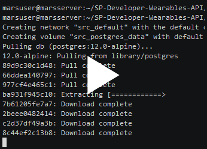
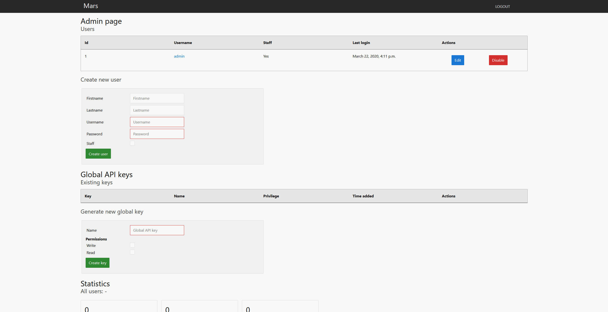
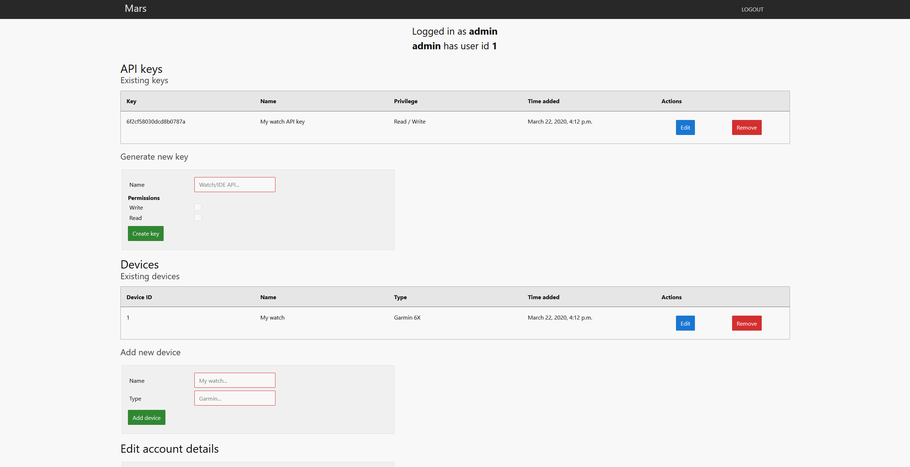
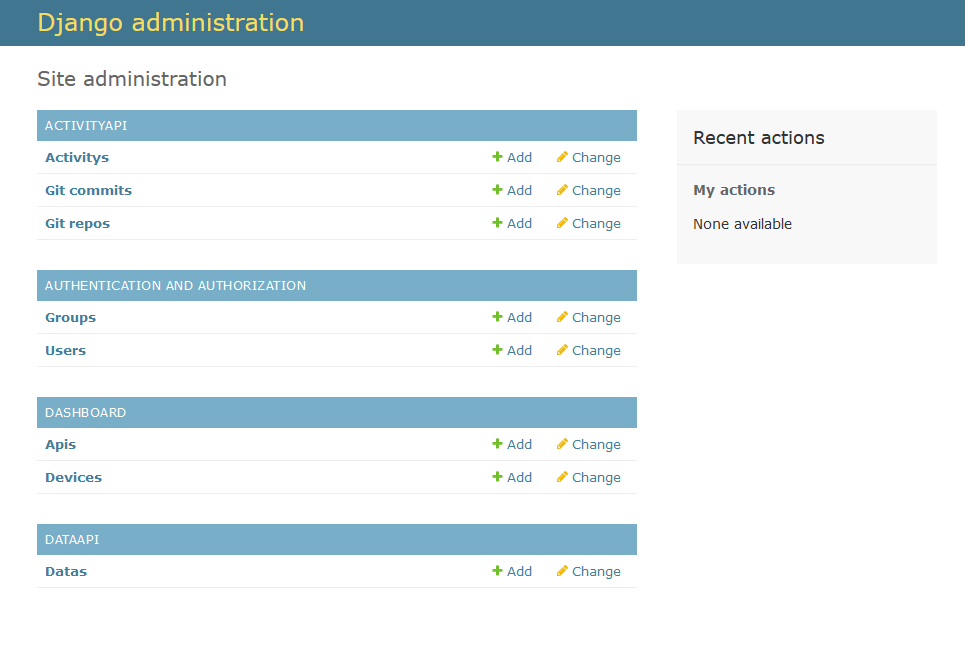

# Developer-Wearables-API
Django dashboard and API for wearable device data collection

MARS - Measurement Activity REST Server (kind of came up with MARS before and just tried to find words that kind of fit..)
## Installation ##
* Clone the git repository
* Go to `src` folder
* Copy `.env.sample` and `.env.db.sample` to `.env` and `.env.db` respectively
* Change values in `.env` and `.env.db` to secure credentials and add hosts etc
* Run the following commands

`sudo docker-compose up -d --build`

To build and run the container

`sudo docker-compose exec web python manage.py migrate --noinput`

To migrate the tables to the database

`sudo docker-compose exec web python manage.py createsuperuser --username admin --email admin@notarealdomain.localhost.local --noinput`

To create an admin user that can then create more users etc. Default password is set in `.env` under `DJANGO_SUPERUSER_PASSWORD`.

`sudo docker-compose exec web python manage.py collectstatic --no-input --clear`

To collect static files (CSS, Javascript, etc) for Nginx

## Dependencies ##
* Docker version 19.03.8
* docker-compose 1.25.4

Tested on Ubuntu Server 18.04 - Use `install_docker.sh` script on Ubuntu Server 18.04 to get started quickly.

## Environment file ##
`DEBUG` set to 1 for debug messages, set to 0 for production environments

`SECRET_KEY` generate long secret key, used for encryption etc

`DJANGO_ALLOWED_HOSTS` add IP address of host running the server (like 10.10.10.31)

`DJANGO_SUPERUSER_PASSWORD` is the default password used for createsuperuser command above (change this and change password of created user)

`SQL_[...]` Set SQL values. `DATABASE`, `USER` and `PASSWORD` has to match in `.env.db`

## Webapp ##

Found at http://x.x.x.x/ or http://x.x.x.x/dashboard

Admin page to add users, global API keys for exporting data from the API and see basic statistics

User page, accessible for users (admins can access other users user-pages) to add devices, API keys and edit settings

Built-in Django admin page with access to all tables/data

## API ##
API information under docs
